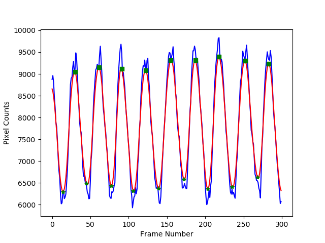
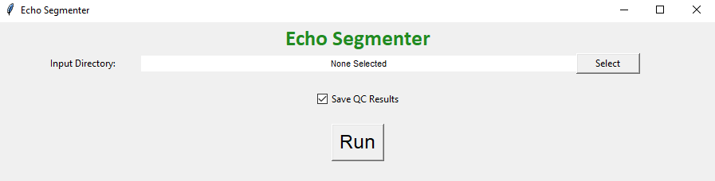

# Mouse Echo Neural Net
Mouse Echo Neural Net (MENN) is an end-to-end deep learning pipeline for automating preclinical echocardiogram (echo) analysis. This pipeline is designed for the analyses of both b-mode and m-mode mouse echo images/videos. The two major steps in this pipeline are:

- Semantic segmentations (e.g., LV on b-mode)
- Calculations of cardiac parameters, including LV area, volume, ejection fraction, anterior/posterior wall thickness, fractional shortening, and LV Mass

# Installation
First, clone this repository and enter the directory:

    git clone https://github.com/pfizer-opensource/mouse-echo-neural-net.git
    cd mouse-echo-neural-net

This project is implemented with Python 3, and need several packages:

- TensorFlow
- Keras
- OpenCV
- Scikit-image
- NumPy
- Pandas
- ...

An easy way to replicate the environment is to use conda:

    conda env create -f environment.yml
    conda activate tf-latest
    pip install PyQt5 --upgrade

Note that tf-latest is the name of the environment. It can be changed directly in the enviroment.yml.

# Example result
The following movie demonstrates the automated segmentation results for an sample data set as compared to the manual segmentation (red vs. green).

# Usage (prediction stage)
To perform the fully automated analysis for b-mode raw DICOM data:

    python echoanalysis_main.py --input_dir path_to_input_file

To save intermediate results for QC purpose:

    python echoanalysis_main.py --verbose --input_dir path_to_input_file

To perform the fully automated analysis for m-mode raw DICOM data:

    python echoanalysis_mmode_main.py --input_dir path_to_input_file

To save intermediate results for QC purpose:

    python echoanalysis_mmode_main.py --verbose --input_dir path_to_input_file

Below is an example figure showing the segmentation results (# of pixels for the LV) for each cardiac phase (x axis) of a b-mode image. The blue curve is the raw result, and the red curve is a smoothed version, which is used to detect the systolic and diastolic phase (green stars and squares):

# User Interface
To operate the program from a user interface, run the Echo_Segmenter_UI_Full.py file (double-click). Use the "Select" button to open a file browser, then navigate to the input directory containing the images to be analyzed. To save intermediate results for QC purposes, leave the "Save QC Results" box checked. Hit "Run" to start the program. When it has completed, a messagebox desplaying "Analysis Complete!" will appear. Hit OK and x-out to close. This tool can be used to segment b-mode or m-mode data, or both.

For more detailed information regarding installation, data preparation, and operation of the User Interface see Echo_Segmenter_User_Manual.txt.

# Contribution
Please reach out to chong.duan@pfizer.com, Mary.Montgomery@pfizer.com or dineshh@pfizer.com if you are interested in collaboration and contribution to this project.
